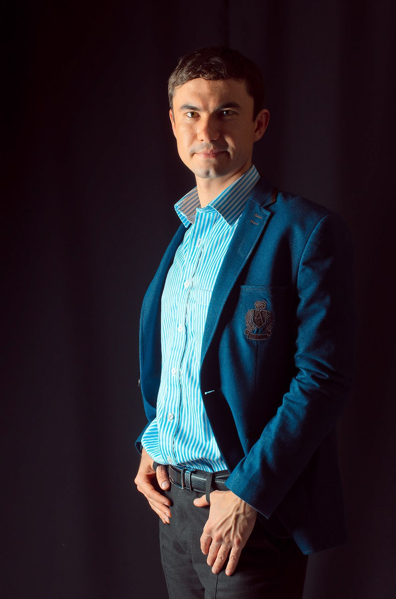

# rsschool-cv

**NAZIMKOV MYKOLA**

Phone number: +38(063)-481-67-18 
Email: nazimkoff@gmail.com  
[GitHub: http://github.com/Nazimkov-1984](http://github.com/Nazimkov-1984) 
[LinkedIn: http://linkedin.com/in/mykola-nazimkov](http://linkedin.com/in/mykola-nazimkov) 
https://nazimkov.pp.ua/ 

**Summary** 
To acquire the position of a junior Front End  Developer and utilize my technical knowledge and experience with opportunity of professional and career growth.

**Education** 
Kremenchuk Mykhaylo Ostrohradskyi National University
Specialty: Geodesy, Land Manager and Cadastre
2002-2007 
**Additional education**  
Course Front-End developer 
Beetroot academy (March 2020 – June 2020) 
Course Java Script + React  
Learning platform Udemy (May2020 – July 2020) 
**Language**  
Ukraine - native 
Russian - native 
English – A1 
**Skills** 
Technologies 
*JavaScript, React, Vue, AJAX, JSON, HTML, CSS,  SCSS,  Bootstrap (grid & components), Flexbox, API.* 
Tracking system 
*Trello* 
Tools  
*VS Code,  VS, Gulp, WebPack, Photoshop, Figma, Git,  Lighthouse* 

